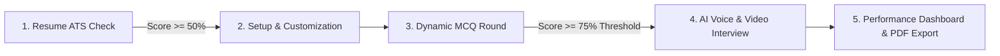
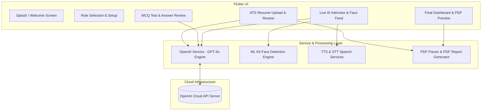
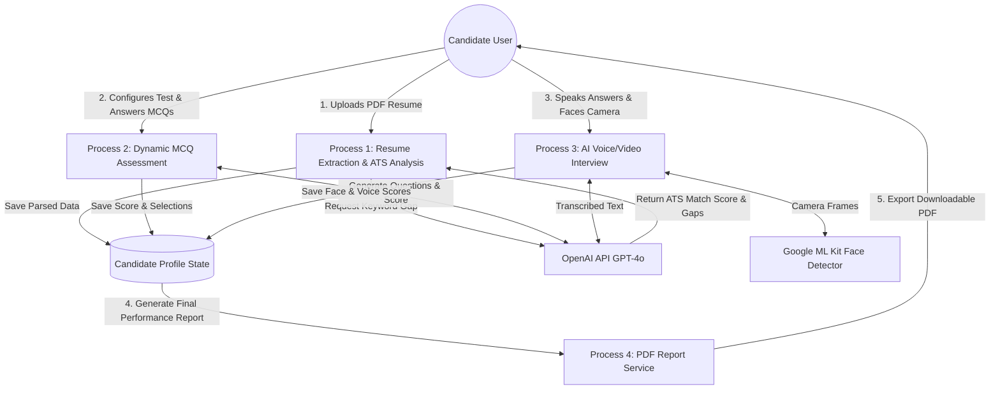
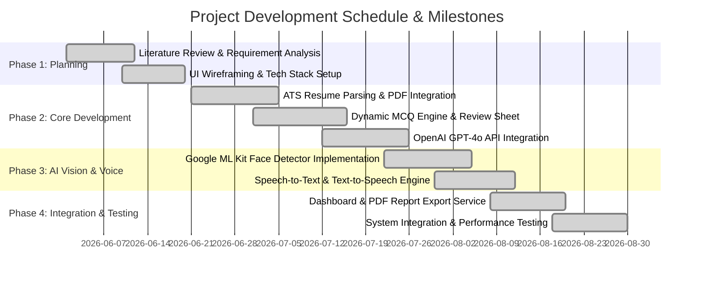

# SmartBro AI Interview Simulator - Master Academic & Project Presentation Deck

---

## **Slide 1: Title & Introduction of Project**
* **Slide Title:** SmartBro AI Interview Simulator & Career SuperApp
* **Subtitle:** An Automated, AI-Driven Placement Preparation Platform with ATS Resume Screening, Dynamic MCQ Testing, Real-Time Face Proctoring & Voice Interviews
* **Presenter Information:** Computer Science & Engineering Project Team

### **1. Background & Problem Statement**
* **The Placement Gap:** Traditional interview preparation relies on self-study or high-cost human mock interviews, creating a huge preparation gap for job applicants.
* **Opaque Resume Screening:** Applicant Tracking Systems (ATS) filter out up to 75% of candidates automatically without providing feedback on missing keywords or formatting flaws.
* **Lack of Real-Time Interview Proctoring Feedback:** Candidates rarely receive feedback on eye contact, head pose/confidence, or verbal fluency during mock sessions.

### **2. Project Objectives**
* **Automated ATS Evaluation:** Extract resume data from PDF files, compare skills against job descriptions, and output keyword gaps & match scores.
* **Adaptive MCQ Assessment:** Generate role-specific technical/aptitude MCQs dynamically using Generative AI, complete with automated grading and qualification thresholds.
* **Interactive AI Voice & Video Interview:** Conduct live audio interviews with synthesized AI questions and speech recognition while monitoring face tracking and head pose via ML Kit.
* **Comprehensive Performance Analytics:** Generate an overall score breakdown (Technical Knowledge, Communication, Face Confidence) and export downloadable PDF evaluation reports.

---

## **Slide 2: Technology Used (Stack Breakdown)**

### **Core Stack Table**
| Layer / Subsystem | Technology / Package | Specific Role & Functionality in Project |
| :--- | :--- | :--- |
| **Mobile Framework** | **Flutter (Dart SDK 3.x)** | Cross-platform UI development for Android and iOS devices. |
| **Generative AI Model** | **OpenAI API (`GPT-4o` / `GPT-4o-mini`)** | Contextual resume analysis, MCQ generation, real-time interview question adaptation, and answer evaluation (`openai_service.dart`). |
| **Computer Vision Engine** | **Google ML Kit Face Detection (`google_mlkit_face_detection`)** | Real-time facial bounding box tracking, head rotation (Euler X, Y, Z angles), eye contact, and proctoring during mock interviews (`face_detector_service.dart`). |
| **Speech Processing** | **`speech_to_text` & `flutter_tts`** | Speech-to-Text (STT) for real-time answer transcription; Text-to-Speech (TTS) for voice synthesis of AI interviewer questions (`voice_service.dart`). |
| **Document Extraction** | **`syncfusion_flutter_pdf` & `file_picker`** | Extracting raw text from user-uploaded PDF resumes for ATS match computation (`upload_resume_screen.dart`). |
| **PDF Generation** | **`pdf` & `printing`** | Creating custom styled PDF reports containing candidate scores, strengths, and areas for improvement (`pdf_report_service.dart`). |
| **Camera & Video Feed** | **`camera` package** | Accessing front camera frame buffer for real-time ML Kit computer vision processing (`interview_screen.dart`). |
| **UI Animations** | **`animate_do`** | Smooth entry/exit micro-animations, fade-ins, and bounce transitions. |

---

## **Slide 3: Proposed Work & Functional Modules**

### **System Workflow Pipeline**

### **Detailed Module Overview**
1. **Module 1: ATS Resume Parser & Score Engine**
   * Parses uploaded resume PDFs using `syncfusion_flutter_pdf`.
   * Evaluates resume against target Job Descriptions using OpenAI `GPT-4o`.
   * Highlights matching skills, missing keywords, work history, and project quality scores.

2. **Module 2: Custom MCQ Assessment Engine**
   * Configurable question counts (10, 20, 30, 50 MCQs) and timed tests (`interview_setup_screen.dart`).
   * Dynamic question generation tailored to the target job role.
   * Auto-evaluates candidate scores and enforces passing thresholds (e.g., 75%).
   * Provides a full **Answer Review Sheet** displaying correct answers and AI explanations (`mcq_result_screen.dart`).

3. **Module 3: Live AI Voice & Video Interview with ML Kit Proctoring**
   * Front camera stream monitored in real time by `google_mlkit_face_detection`.
   * Evaluates candidate head angles (Euler X/Y/Z), detecting off-screen looking or absence.
   * AI synthesizes voice questions (`flutter_tts`) and listens to candidate verbal responses (`speech_to_text`).

4. **Module 4: Analytics Engine & PDF Report Generator**
   * Combines Technical Score, MCQ Score, Speech Fluency, and Face Confidence Score into a unified percentage score.
   * Generates a downloadable PDF report (`pdf_report_service.dart`).

---

## **Slide 4: System Design & Diagrams**

### **1. High-Level Architecture Diagram**

### **2. Data Flow Diagram (DFD Level 1)**

---

## **Slide 5: Implementation Screenshots & Screen Explanations**

### **1. Splash & Role Selection Screens (`splash_screen.dart`, `role_selection_screen.dart`)**
* **UI Features:** Modern branding layout with gradient themes, animated buttons (`animate_do`), and job domain selections (Flutter Developer, Python Developer, Data Scientist, Frontend Engineer, etc.).
* **Functional Logic:** Stores candidate domain selection in memory and initializes system theme state.

### **2. ATS Resume Screening (`upload_resume_screen.dart`, `ats_checker_screen.dart`)**
* **UI Features:** Interactive drag-and-drop file picker, circular progress indicator showing ATS Match Percentage (e.g. 82%), color-coded skill chips (Green for matched, Red for missing).
* **Backend Integration:** `file_picker` opens the PDF file, `syncfusion_flutter_pdf` extracts raw text, and `openai_service.dart` analyzes match percentage against the selected role.

### **3. Interview Setup & MCQ Screening (`interview_setup_screen.dart`, `mcq_test_screen.dart`)**
* **UI Features:** Question count selectors (10, 20, 30, 50 questions), real-time countdown timer, question progress bar, option radio buttons.
* **Backend Integration:** `OpenAIService.generateMCQs()` fetches dynamically structured JSON questions. The timer triggers auto-submission upon expiry.

### **4. MCQ Result & Answer Review Modal (`mcq_result_screen.dart`)**
* **UI Features:** Dynamic pass/fail header badge ("QUALIFIED FOR INTERVIEW ROUND" vs "NOT QUALIFIED"), score circular progress bar (e.g. 80%), passing threshold display ("Passing threshold: 75%"), and a bottom sheet allowing full question-by-question review with AI explanations.
* **Backend Integration:** Enforces passing logic (`percentage >= 75`). Displays conditionally routed buttons: "Continue to AI Interview" if passed, or "Return to Home" if failed.

### **5. Live AI Voice & Video Interview Screen (`interview_screen.dart`)**
* **UI Features:** Split screen displaying front camera feed with real-time face detection overlay box, AI Avatar status indicator ("Listening...", "AI Thinking...", "Speaking..."), real-time transcript container.
* **Backend Integration:** `FaceDetectorService` inspects camera frames at 30 FPS. `speech_to_text` captures user speech, sends input to `OpenAIService`, and synthesizes response via `flutter_tts`.

### **6. Final Dashboard & PDF Preview (`final_dashboard_screen.dart`, `report_preview_screen.dart`)**
* **UI Features:** Overall score badge, multi-dimensional radar/bar score breakdown (Technical Accuracy, Communication, Face Confidence), actionable feedback list, and "Export PDF Report" action button.
* **Backend Integration:** `pdf_report_service.dart` builds a multi-page PDF document using Flutter's native `pdf` library and presents it in `PrintingInfo` preview.

---

## **Slide 6: Time Line Chart (Project Gantt Chart)**

---

## **Slide 7: Future Work & Project Expansion**

* **1. Multi-Lingual Support:** Expand voice-to-voice interview interaction to support regional languages (Hindi, Gujarati, Spanish, German, French).
* **2. Vocal Pitch & Micro-Expression Analytics:** Incorporate real-time audio pitch analysis to measure speech confidence and emotion detection (stress/nervousness indicators).
* **3. Institutional & HR Portal:** Build a web dashboard for university placement cells and corporate recruiters to view candidate video recordings, proctoring flags, and ATS rankings.
* **4. Peer-to-Peer Collaborative Mock Rooms:** Allow candidate-to-candidate live mock sessions moderated by an automated AI co-pilot observer.

---

## **Slide 8: Conclusion**

* **Successful Implementation:** Successfully engineered a full-stack, cross-platform mobile AI interview preparation app using Flutter, OpenAI GPT-4o, and Google ML Kit.
* **Key Achievements:**
  * Automated ATS resume screening with instant keyword gap analysis.
  * Dynamic role-tailored MCQ screening tests with passing score enforcement and full answer review capabilities.
  * Interactive voice interview with real-time computer vision proctoring and face tracking.
  * Automated generation of downloadable PDF performance reports.
* **Impact:** Provides an accessible, objective, and scalable solution for candidates to build technical confidence and improve placement success rates.

---

## **Slide 9: References (Academic & Technical)**

1. **Flutter Framework Documentation:** Google Developers. *Flutter Architectural Overview & SDK Reference*, 2026. [https://flutter.dev/docs](https://flutter.dev/docs)
2. **OpenAI API Platform:** OpenAI. *GPT-4o Model Architecture & API Documentation*, 2026. [https://platform.openai.com/docs](https://platform.openai.com/docs)
3. **Google ML Kit Vision API:** Google Developers. *Face Detection On-Device API Guide*, 2026. [https://developers.google.com/ml-kit/vision/face-detection](https://developers.google.com/ml-kit/vision/face-detection)
4. **Applicant Tracking Systems & AI Recruitment:** Standard HR & Recruitment AI Guidelines, *Journal of Artificial Intelligence in Human Resources*, 2025.
5. **Dart Open Source Packages:** Pub.dev Package Repository (`google_mlkit_face_detection`, `speech_to_text`, `flutter_tts`, `syncfusion_flutter_pdf`, `printing`, `animate_do`).
