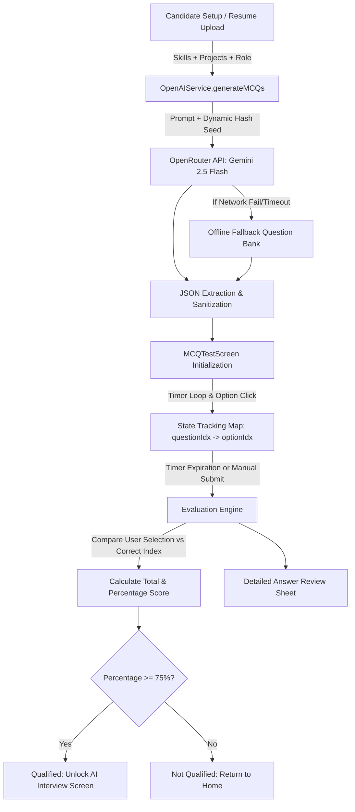

# Technical Guide: MCQ Generation and Evaluation Engine

## 📌 Executive Summary
The **MCQ Generation and Evaluation Engine** is a core component of the AI Interview Simulator platform. It produces dynamically generated, candidate-customized Multiple Choice Question (MCQ) assessments to screen candidate technical aptitude and role readiness before advancing them to the interactive AI Voice Interview round.

---

## 🏗️ System Architecture & Workflow



---

## ⚙️ 1. Dynamic Question Generation Logic (`OpenAIService.generateMCQs`)

### A. Contextual Inputs
The generation engine customizes questions using three primary data points:
1. **Candidate Profile:** Extracted resume skills (e.g., `Dart`, `Python`, `Docker`, `SQL`) and project titles.
2. **Target Technical Role:** Desired job profile (e.g., *AI Engineer*, *Flutter Developer*, *Backend Specialist*).
3. **Interviewer Config:** Configurable parameters for number of Aptitude questions (`numAptitude`), Technical questions (`numTechnical`), and time allocated per question (`minutesPerQuestion`).

### B. Anti-Repetition & Dynamic Seeding
To prevent static question repeat or identical test runs across sessions:
- A unique mathematical seed is generated per session:
  $$\text{seed} = \text{Epoch Timestamp (ms)} + \text{Random}(0, 999999)$$
- The seed is injected into the AI prompt instructions to enforce unique problem scenarios.

### C. Question Categorization Rules
- **Aptitude MCQs:** Generated by sampling from 27 randomized topics (*Arithmetic, Percentage, Ratio, Probability, Time & Work, Logical Reasoning, Syllogisms, Coding-Decoding, etc.*).
- **Technical MCQs:** Enforces strict priority intersection:
  1. *Primary:* Selected Job Role
  2. *Secondary:* Extracted Resume Projects
  3. *Tertiary:* Extracted Resume Skills
- Prompts prohibit generic definition questions (*"What is Dart?"*) and enforce complex multi-sentence scenario-based engineering/architecture problems.

### D. JSON Extraction, Normalization & Deduplication
- **JSON Parsing:** Uses regex-based JSON block extraction to extract clean arrays from LLM outputs.
- **Normalization:** Validates required fields (`category`, `topic`, `statement`, `options`, `correctIndex`).
- **Deduplication:** Hash-checks statement strings to eliminate duplicate questions.
- **Fallback Guarantee:** If the primary API call fails after retry attempts, the service automatically switches to `_fallbackMCQs()` (a local bank of curated aptitude and technical questions), preventing user lockout.

---

## ⏱️ 2. Real-Time Test Management (`MCQTestScreen`)

### A. Dynamic Timer Calculation
Test duration is calculated dynamically:
$$\text{Total Duration (Seconds)} = (\text{numAptitude} + \text{numTechnical}) \times \text{minutesPerQuestion} \times 60$$

- A 1-second interval timer monitors test duration.
- The UI timer badge updates color dynamically:
  - 🟢 **Green:** $>50\%$ remaining
  - 🟡 **Yellow:** $25\% - 50\%$ remaining
  - 🔴 **Red:** $<25\%$ remaining
- Upon timer expiry (`00:00`), `_finishTest()` is automatically executed.

### B. State Management
- Option selections are stored in a reactive state map:
  $$\text{Map<int, int?> } \text{\_selectedOptions} = \{\text{questionIndex}: \text{selectedOptionIndex}\}$$
- Candidates can freely navigate back and forth across questions using a dynamic pagination bar or Next/Previous actions before final submission.

---

## 🎯 3. Evaluation & Threshold Verification (`MCQResultScreen`)

### A. Scoring Algorithm
Upon completion, the engine compares the candidate's selected index against the answer key:

```dart
int score = 0;
for (int i = 0; i < questions.length; i++) {
  final selected = _selectedOptions[i];
  if (selected != null && selected == questions[i]['correctIndex']) {
    score++;
  }
}
double percentage = (score / total) * 100;
```

### B. 75% Qualification Threshold
- **Passing Rule:** Candidate must achieve a percentage score $\ge 75\%$.
- **Qualified ($\ge 75\%$):** Displays a trophy badge, score breakdown, and enables the **"Continue to AI Interview"** button (`AIInterviewScreen`).
- **Not Qualified ($< 75\%$):** Displays a failure alert and directs the candidate to **"Return to Home"** to retry.

### C. Comprehensive Answer Review
Candidates can open the **"Review All Answers"** bottom sheet modal to inspect:
- **Correct Option:** Flagged with a green badge (`✓ Correct`).
- **Candidate Option:** Flagged with a red badge if incorrect (`✗ Your Answer`).
- **Explanation:** In-depth explanation of the solution logic when available.

---

## 📌 Summary Matrix

| Phase | Responsible Class | Key Responsibilities |
| :--- | :--- | :--- |
| **Generation** | `OpenAIService` | Context parsing, prompt hashing, Gemini API query, JSON normalization, offline fallback |
| **Execution** | `MCQTestScreen` | Real-time countdown timer, option selection state, dynamic UI progress, pagination |
| **Evaluation** | `MCQResultScreen` | Correct index validation, percentage calculation, 75% threshold gatekeeping, answer review modal |
