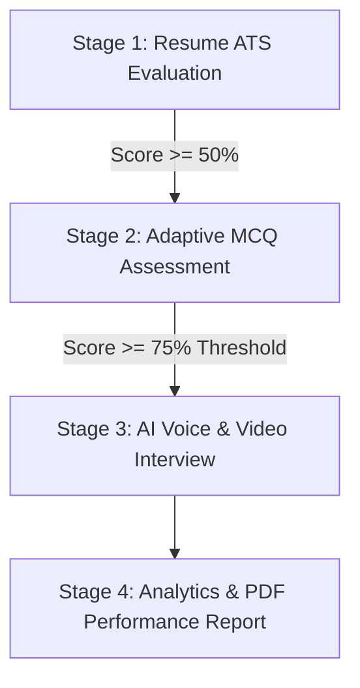
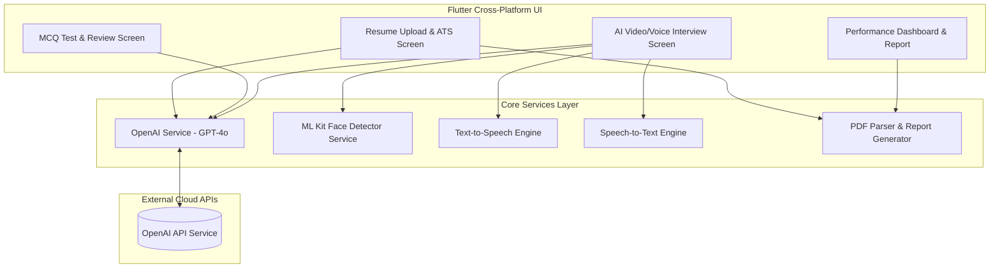
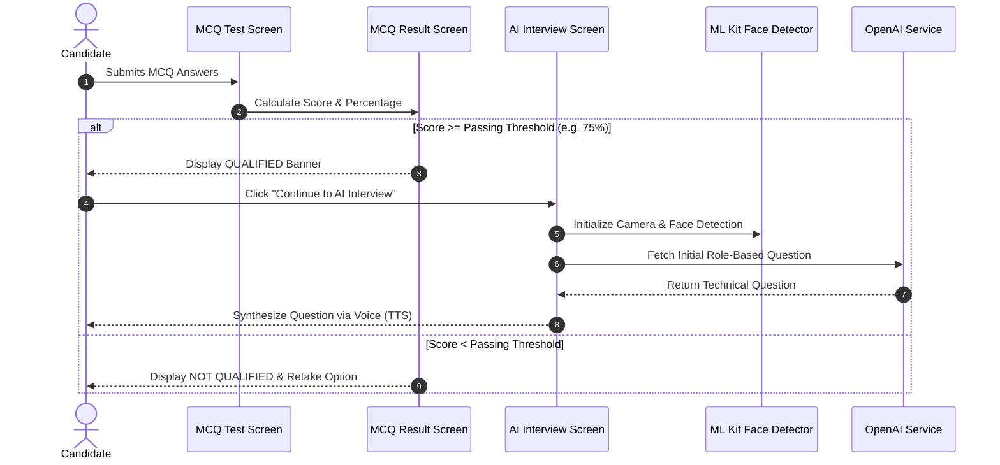
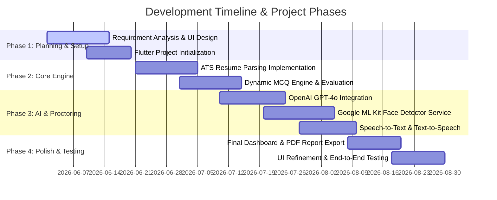

# AI Interview Simulator - Academic & Professional Presentation Content

---

## Part 1: Recommended Prompt Template for Antigravity

When asking Antigravity to generate presentations, slides, or technical documentation for this project, you can copy and use the optimized prompt format below:

```text
Act as a Senior AI Architect and Lead Software Engineer. Generate detailed presentation slides for my project "SmartBro AI Interview Simulator".

Requirements:
1. Use real project details: Flutter cross-platform mobile app, OpenAI GPT-4o integration, Google ML Kit face/head-pose detection, Speech-to-Text & Text-to-Speech audio processing, Syncfusion PDF parsing, and dynamic performance reporting.
2. Format as slide-by-slide content with clear headings, bullet points, and explanation notes.
3. Include system architecture and workflow diagrams using Mermaid.js syntax.
4. Include detailed screen-by-screen implementation descriptions.
5. Cover all standard sections: Introduction, Technology Used, Proposed Work, System Design, Implementation Screenshots with Explanations, Timeline Chart, Future Work, Conclusion, and References.
```

---

## Part 2: Complete Slide Content (Sections A to K)

### Slide 1: Introduction of Project
* **Project Name:** SmartBro AI Interview Simulator & Placement Preparation Platform
* **Problem Statement:**
  * Candidates often lack access to realistic, real-time mock interview environments.
  * Resume shortlisting (ATS filtering) is opaque, causing high rejection rates before interviews occur.
  * Human mock interviews are expensive, non-scalable, and lack objective visual/vocal behavior feedback.
* **Objectives:**
  * Build an end-to-end automated interview ecosystem.
  * Evaluate candidate resumes using AI-driven Applicant Tracking System (ATS) matching algorithms.
  * Conduct dynamic MCQ screening tests with flexible difficulty thresholds (e.g., 75% qualification score).
  * Deliver interactive, voice-guided AI technical mock interviews with real-time video proctoring and face tracking.
  * Provide downloadable, detailed PDF analytical performance reports.

---

### Slide 2: Technology Used (Tech Stack Breakdown)

| Category | Technology / Package | Purpose / Function in Project |
| :--- | :--- | :--- |
| **Frontend Framework** | **Flutter (Dart)** | Cross-platform mobile user interface (iOS & Android) with responsive animations (`animate_do`). |
| **Generative AI / LLM** | **OpenAI API (`GPT-4o` / `GPT-4o-mini`)** | Context-aware resume parsing, dynamic MCQ generation, real-time interview question adaptation, and answer evaluation. |
| **Computer Vision** | **Google ML Kit Face Detection (`google_mlkit_face_detection`)** | Real-time face tracking, head-pose detection, eye contact monitoring, and proctoring during mock interviews. |
| **Audio & Speech Engine**| **`flutter_tts` & `speech_to_text`** | Text-to-Speech for voice-synthesized AI interviewer questions; Speech-to-Text for realtime candidate answer transcription. |
| **Document Processing** | **`syncfusion_flutter_pdf` & `file_picker`** | PDF text extraction for resume evaluation against target job profiles. |
| **PDF & Report Generation**| **`pdf` & `printing`** | Custom PDF report generation and native print/export preview capability. |
| **Camera & Hardware** | **`camera` package** | Real-time video frame streaming for facial analysis during interview sessions. |

---

### Slide 3: Proposed Work & Functional Modules

The system follows a 4-Stage Progressive Pipeline:



1. **Stage 1: Smart ATS Resume Analyzer**
   * Parses uploaded resume PDFs (`upload_resume_screen.dart`).
   * Extracts candidate skills, work experience, projects, and education (`ats_checker_screen.dart`).
   * Computes an ATS Match Score against job descriptions with actionable keyword gap analysis.

2. **Stage 2: Custom MCQ Assessment System**
   * Configurable question counts (10, 20, 30, 50 questions) and timed environments (`interview_setup_screen.dart`).
   * Generates dynamic technical and aptitude questions using OpenAI API.
   * Auto-evaluates candidate performance with answer review breakdown (`mcq_result_screen.dart`).

3. **Stage 3: AI Voice & Video Interview with Real-Time Proctoring**
   * Interactive voice conversation with AI avatar (`interview_screen.dart`).
   * Concurrent camera stream monitoring candidate presence, head angle, and attention using ML Kit (`face_detector_service.dart`).
   * Dynamic follow-up question generation tailored to technical domains.

4. **Stage 4: Comprehensive Performance Dashboard & Export**
   * Computes overall score based on technical accuracy, communication clarity, and visual confidence.
   * Generates professional PDF report containing strengths, weaknesses, and key improvement areas (`pdf_report_service.dart`).

---

### Slide 4: System Design & Diagrams

#### 1. System Architecture Diagram



#### 2. Sequence Diagram - MCQ to AI Interview Transition



---

### Slide 5: Implementation Screens & Explanations

1. **Splash & Welcome Screen (`splash_screen.dart`, `welcome_screen.dart`)**
   * Premium UI onboarding introducing platform capabilities with smooth animations.

2. **Role & Interview Setup (`role_selection_screen.dart`, `interview_setup_screen.dart`)**
   * Candidate selects target domain (e.g., Flutter Developer, Python Engineer, Data Scientist).
   * Configures test length, time limits, and reviews passing criteria rules.

3. **ATS Checker Screen (`ats_checker_screen.dart`, `upload_resume_screen.dart`)**
   * Uploads resume PDF, displays parsed details (Skills, Experience, Projects), and presents match percentage ring.

4. **MCQ Test & Result Review (`mcq_test_screen.dart`, `mcq_result_screen.dart`)**
   * Displays timed questions with progress tracking.
   * Result screen features score percentage ring, qualification status card, and collapsible question-by-question answer review modal.

5. **AI Voice & Video Interview Screen (`interview_screen.dart`)**
   * Live camera preview overlay powered by `google_mlkit_face_detection`.
   * Displays candidate head orientation indicator, real-time speech transcription, and AI voice responses.

6. **Final Performance Dashboard (`final_dashboard_screen.dart`, `report_preview_screen.dart`)**
   * Comprehensive score breakdown (Technical Knowledge, Communication Skills, Confidence & Face Proctoring).
   * Interactive chart representation and "Export PDF Report" button.

---

### Slide 6: Time Line Chart (Project Roadmap)



---

### Slide 7: Future Work & Enhancements

* **Multi-Lingual Support:** Expand voice interviews to support regional languages (Hindi, Gujarati, Spanish, French).
* **Advanced Emotion Analytics:** Integrate pitch frequency and micro-expression emotion detection algorithms.
* **Recruiter / HR Dashboard:** Web portal allowing recruiters to view candidate scores and video interview logs.
* **Peer-to-Peer Mock Interviews:** Collaborative live mock practice sessions between candidates with AI co-pilot feedback.

---

### Slide 8: Conclusion

* Successfully built an end-to-end AI-powered interview simulator mobile app in Flutter.
* Solved major candidate preparation bottlenecks by providing automated ATS analysis, dynamic adaptive MCQs, and real-time voice/video mock interviews.
* Integrated ML Kit computer vision for objective visual feedback and OpenAI GPT-4o for intelligent interview feedback.
* Significantly improves job readiness, technical confidence, and interview qualification rates for candidates.

---

### Slide 9: References

1. **Flutter Framework:** Flutter Documentation - [https://flutter.dev/docs](https://flutter.dev/docs)
2. **OpenAI API Specifications:** OpenAI API Documentation - [https://platform.openai.com/docs](https://platform.openai.com/docs)
3. **Google ML Kit:** Google Developers ML Kit Face Detection Guide - [https://developers.google.com/ml-kit/vision/face-detection](https://developers.google.com/ml-kit/vision/face-detection)
4. **Dart Packages:** Pub.dev Package Repository (`google_mlkit_face_detection`, `speech_to_text`, `flutter_tts`, `syncfusion_flutter_pdf`, `printing`).
